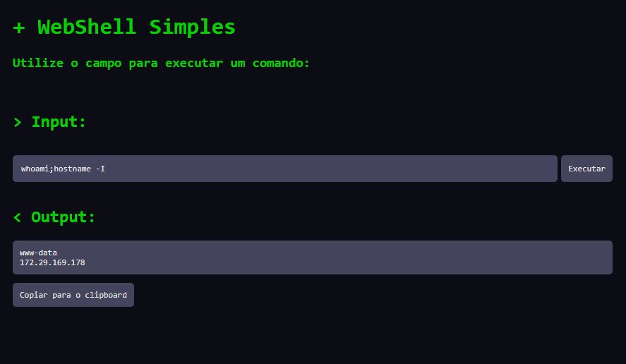

<h1 align="center">sWSH</h2>

<h4 align="center"><strong>sWSH is just another simple webshell made for educational purpose.</strong></h4>

<p align="center">
  
</p>

<hr>

## - Installation
> **Note**
>
> PHP 8.1 or superior
```console
$ git clone https://github.com/RodricBr/Simple-PHP-WebShell

# And then run on your localhost as wsh.php
```

<br>
